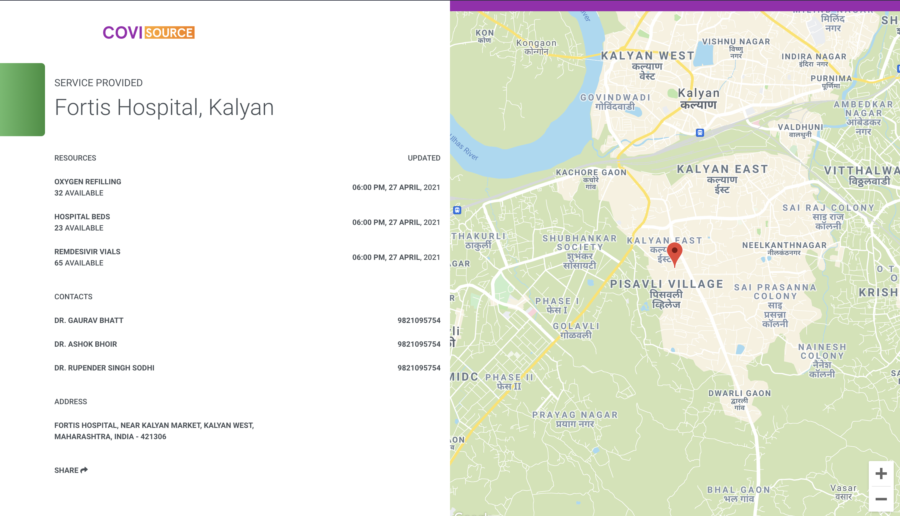

# CoviSource - Real-time Resources for COVID-19

A collection of resources for COVID-19 updated in real time by the frontline providers
themselves to help in bridging the gap between the patient and resources. :rocket:

## Why this Website?

Amidst the ongoing pandemic, we need reliable and real time updates for all the resources to 
help COVID patients save precious time and their lives. :white_check_mark:

This is thought to be achieved through the collective efforts of doctors,
nurses, volunteers and other health workers to update about the available
resources in their medical institute/provider directly into this website. :couple:

We hope to bring a positive change in these depressing times and strive
to help everyone get over this situation through this open-source initiative. :sparkles:

## Contributors

We would be glad to recieve your help and make this website even better for the ones suffering 
from COVID. Your help can save many lives. :pray:

You may contribute through submitting some code, reporting some bugs/issues, spreading
awareness about this website to your local medical institutes, sharing about this website
on social media or donating funds to the project.

For submitting code and bugs/issues, kindly go through our 
[Contribution Guidelines](/.github/CONTRIBUTING.md).